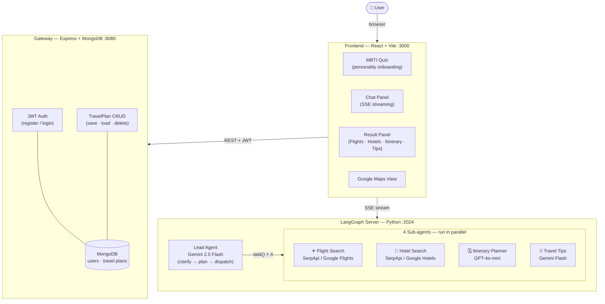

# Nomie — AI Travel Planning Agent

An AI-powered travel planning agent that personalizes recommendations based on your travel personality. Users take a 90-second MBTI-style travel quiz, then chat with an AI companion that searches real-time flights, hotels, generates itineraries, and displays results on Google Maps.

**Team**:
- KANG Jinyu (A0330139M)
- LI Jingwen (A0328022R)
- LI Zouran (A0329022N)

---

## Problem Statement

Planning a trip today means juggling six tabs at once — Google Flights for prices, Booking.com for hotels, TripAdvisor for reviews, Reddit for local advice, YouTube for vlog inspiration, and a spreadsheet to hold it together. It is exhausting, and the results are still generic.

Existing tools search well but do not *understand* the traveler. A solo backpacker has completely different needs from a family of four or a couple on a honeymoon. Budget matters, travel style matters, must-see interests matter — yet every platform serves the same ranked list to everyone.

Nomie addresses this by combining **personality-aware AI** with **real-time multi-source search**:
1. A 90-second travel personality quiz captures your travel style (adventure vs. comfort, solo vs. group, budget vs. luxury).
2. A conversational AI companion collects your destination, dates, and preferences through natural chat — no forms to fill.
3. Four specialized sub-agents search flights, hotels, itineraries, and travel tips **in parallel**, returning real prices and real booking links.
4. Results are shown as structured cards, not walls of text — flights with airline links, hotels with photos and ratings, a day-by-day map itinerary.

---

## Why Nomie vs. Existing Tools

| | TripAdvisor | Google Travel | Kayak | **Nomie** |
|---|---|---|---|---|
| Conversational input | ✗ | ✗ | ✗ | ✅ Chat-based |
| Personality-aware | ✗ | ✗ | ✗ | ✅ MBTI quiz |
| Flights + Hotels + Itinerary in one place | Partial | Partial | Partial | ✅ All 4 in one |
| Real-time parallel search | ✗ | ✓ | ✓ | ✅ 4 agents in parallel |
| Day-by-day itinerary | ✗ | ✗ | ✗ | ✅ Generated |
| Map visualization | ✗ | ✓ | ✗ | ✅ Google Maps |
| Curated plan, not a list | ✗ | ✗ | ✗ | ✅ |

TripAdvisor and Kayak are aggregators — great for comparing prices, but they require the user to know exactly what they want and do all the planning themselves. Google Travel comes closest but remains a search interface with no conversational layer and no itinerary generation. Nomie acts as a **travel planning agent**: it asks the right questions, searches on your behalf, and returns a complete plan ready to act on.

---

## Quick Start

### Prerequisites

- Node.js 18+
- Python 3.12+
- Docker Desktop (for MongoDB + Gateway)
- API Keys (see Environment Variables below)

### 1. Clone and install

```bash
git clone https://github.com/IT5007-2520/course-project-project_3.git
cd course-project-project_3
```

### 2. Backend (LangGraph Agent Server)

```bash
cd backend
pip install uv          # if not installed
uv sync                 # install Python dependencies
cp .env.example .env    # then fill in API keys (see below)
make dev                # starts on http://localhost:2024
```

### 3. Gateway (Auth + Database)

```bash
# Make sure Docker Desktop is running
cd docker
docker-compose up --build -d    # starts MongoDB (:27017) + Gateway (:8080)
```

Gateway needs its own `.env` file:
```bash
cd gateway
cp .env.example .env    # then set JWT_SECRET (see below)
```

### 4. Frontend

```bash
cd frontend
npm install
cp .env.example .env    # then fill in URLs and API keys (see below)
npm run dev             # starts on http://localhost:3000
```

### 5. Open the app

Visit http://localhost:3000. Register an account, take the MBTI quiz, then start chatting!

---

## Environment Variables

### backend/.env

```
GOOGLE_API_KEY=<Gemini API key>
OPENAI_API_KEY=<OpenAI API key>
TAVILY_API_KEY=<Tavily web search key>
SERPAPI_API_KEY=<SerpApi key for Google Flights/Hotels>
```

### gateway/.env

```
PORT=8080
MONGO_URI=mongodb://localhost:27017/nomie
JWT_SECRET=<random 64-char hex string>
JWT_EXPIRES_IN=24h
CORS_ORIGIN=http://localhost:3000
NODE_ENV=development
```

Generate JWT_SECRET: `node -e "console.log(require('crypto').randomBytes(32).toString('hex'))"`

### frontend/.env

```
VITE_LANGGRAPH_URL=http://localhost:2024
VITE_GATEWAY_URL=http://localhost:8080
VITE_GOOGLE_MAPS_KEY=<Google Maps JavaScript API key>
```

---

## Architecture



### Component responsibilities

| Component | Tech | Responsibility |
|---|---|---|
| Frontend | React 19, Vite | MBTI quiz, chat UI, result cards, Google Maps |
| Gateway | Express 5, MongoDB 7 | JWT auth, TravelPlan CRUD — no agent logic |
| LangGraph Server | Python, LangGraph | Lead agent + 4 parallel sub-agents, SSE streaming |

**Key design decision**: Gateway and LangGraph Server never talk to each other. The frontend connects to both independently — REST for auth/persistence, SSE for live agent output. This keeps the agent layer stateless and independently deployable.

### Data flow for a typical search

```
User types "I want to go to Tokyo next month"
  → Lead Agent (clarify): asks for dates, origin, traveler count
  → User confirms: "Start searching!"
  → Lead Agent dispatches 4 task() calls simultaneously
      ├─ flight-search  → SerpApi Google Flights  → FlightCard[]
      ├─ hotel-search   → SerpApi Google Hotels   → HotelCard[]
      ├─ itinerary      → GPT-4o-mini             → ItineraryDay[]
      └─ travel-tips    → Gemini Flash            → TipsSection[]
  → Each result streams back via SSE as cards appear in the Result Panel
  → User saves plan → Gateway writes to MongoDB
```

---

## Features

### Frontend
- MBTI-style travel personality quiz (5 questions, 8 personality types)
- AI chat with personality-aware suggestions
- Real-time flight/hotel search results with booking links
- Day-by-day itinerary with Google Maps integration
- Travel tips with expandable sections
- Save/load/delete travel plans (MongoDB persistence)
- JWT authentication (register/login)

### Backend
- Multi-agent orchestration: 4 sub-agents run in parallel
- Real-time data: SerpApi Google Flights + Google Hotels
- Mixed model routing: Gemini 2.5 Flash + GPT-4o-mini
- SSE streaming for real-time UI updates
- User profile storage (MBTI type, preferences)
- TravelPlan CRUD with full itinerary persistence

---

## Borrowed Code / References

- **DeerFlow** (ByteDance): Base agent framework — LangGraph architecture, middleware system, sub-agent delegation. https://github.com/bytedance/deer-flow
- **SerpApi**: Google Flights and Google Hotels real-time data
- **Google Maps JavaScript API**: Itinerary map visualization
- Open source libraries: React, LangGraph, LangChain, Express, Mongoose, bcryptjs, jsonwebtoken, Zod
